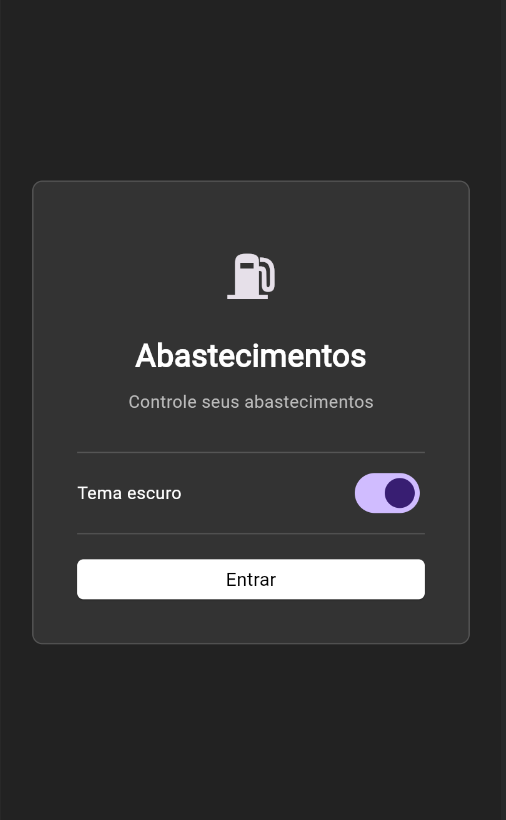

---

##  README -  Projeto **Abastece+** 


# Abastece+ ⛽

Aplicativo Flutter para controle de abastecimentos de veículos.  
Permite registrar valor, litros, quilometragem e calcular consumo médio.

## 🚀 Funcionalidades
- Splash screen com seleção de tema.
- Tela inicial com lista de abastecimentos.
- Modal para adicionar novo abastecimento (data, litros, valor, km).
- Cálculo automático de consumo médio.
- Tema escuro e claro configurados.
- Campos de texto estilizados e legíveis.

## 🛠️ Tecnologias
- [Flutter](https://flutter.dev) SDK 3.12+
- [shared_preferences](https://pub.dev/packages/shared_preferences) para salvar dados localmente.
- [fl_chart](https://pub.dev/packages/fl_chart) para gráficos de consumo.


## ▶️ Como rodar
1. Clone o repositório:
   ```bash
   git clone <url-do-repo>
   flutter pub get
   flutter run

---- 
## 📱 Screenshots

### Tela inicial


### Histórico em tabela


